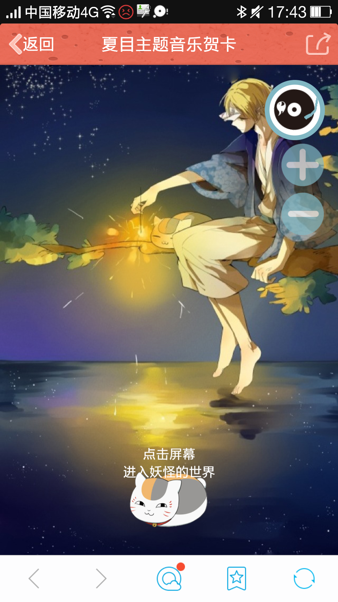
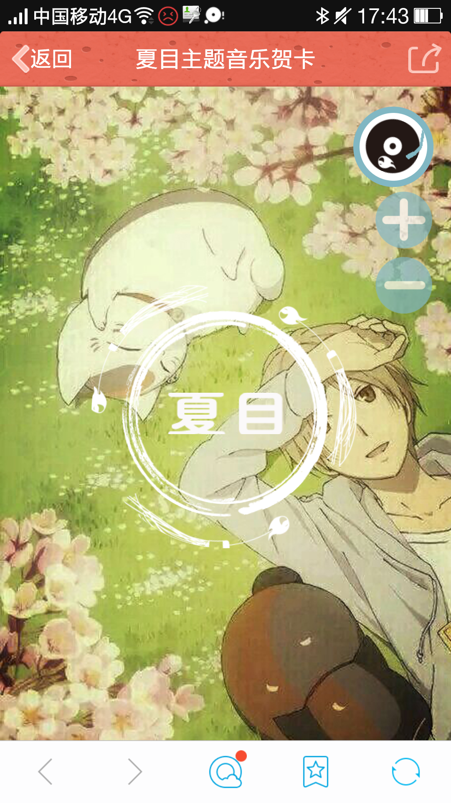
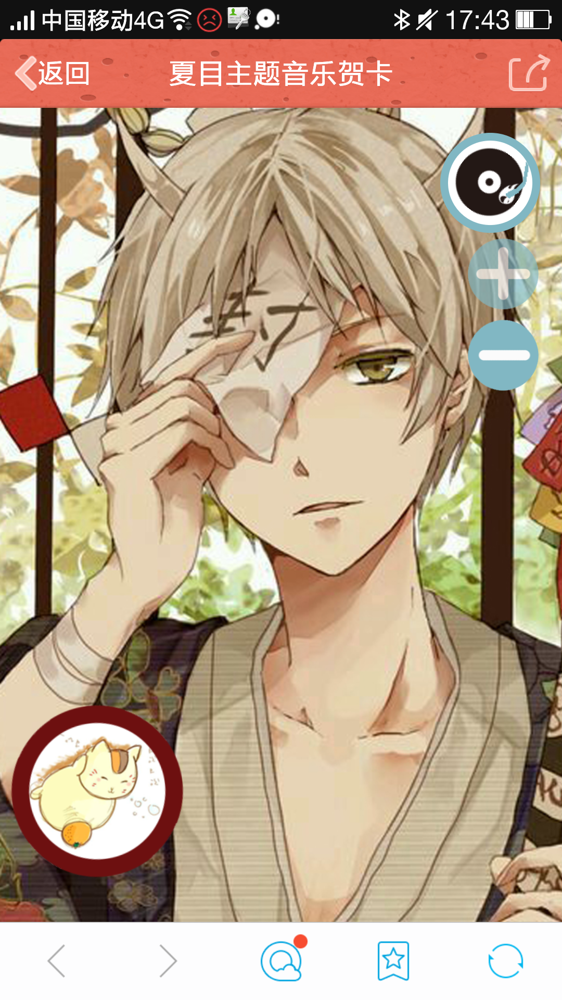

# The-GreetCard-to-Natsume-s-Book-of-Friends
a greeting card which describes of the Natsume's Book of Friends，and it can play music or adjust the volume

模仿慕课网的一个教程，以夏目友人帐为主题做了一个音乐电子贺卡，主要是运行在手机端或chrome手机模式，在右上角的组件中，点击“+”“-”号可以调节音乐音量大小，点击旋转的唱片可以“播放”“暂停”音乐

The url（直接访问的网址）:https://orangesnow.github.io/The-GreetCard-to-Natsume-s-Book-of-Friends/GreetCard%20of%20Natsume/index.html

### 主要功能包括：
页面淡入淡出、CSS动画（灯光闪烁、图片旋转）、音乐播放与暂停、音量大小调节

### 主要技术：
大部分功能主要用animation+@keyframe+transform属性实现。

<b>自适应</b>移动端需要以vh和vw为单位。

## 在手机端运行截图
如图所示，通过JS三个画面会按顺序转换

右上角音乐播放器通过绝对定位固定

并通过JS调节音量大小，暂停、播放音乐

## 音乐播放器代码
var music=document.getElementById("music");

	var audio=document.getElementsByTagName("audio")[0];
	
	var n11=document.getElementById("n1");//加音量
	
	var n12=document.getElementById("n2");//减音量
	
	audio.volume = 0.6;

	n11.addEventListener("touchstart",function(event){
	
		if(audio.volume>=0&&audio.volume<=1){
		
			audio.volume=audio.volume+0.1;
			
		}	
		
	},false);
	
	n12.addEventListener("touchstart",function(event){
	
		if(audio.volume>=0&&audio.volume<=1){
		
			audio.volume=audio.volume-0.1;
			
		}
		
	},false);

	audio.addEventListener("ended",function(event){
	
		music.setAttribute("class","");
		
	},false)

	music.addEventListener("touchstart",function(event){
	
		if(audio.paused){
		
			audio.play();
			
			this.setAttribute("class","play");
			
			}else{
			
			audio.pause();
			
			this.setAttribute("class","");
			
			}
			
	},false);
	
	page1.addEventListener("touchstart",function(event){
	
		page1.style.display="none";
		
		page2.style.display="block";
		
		page3.style.display="block";
		
		page3.style.top="100%"

		setTimeout(function(){
		
			page2.setAttribute("class","page fadeOut");
			
			page3.setAttribute("class","page fadeIn");
			
		},5500)
		
	},false);
