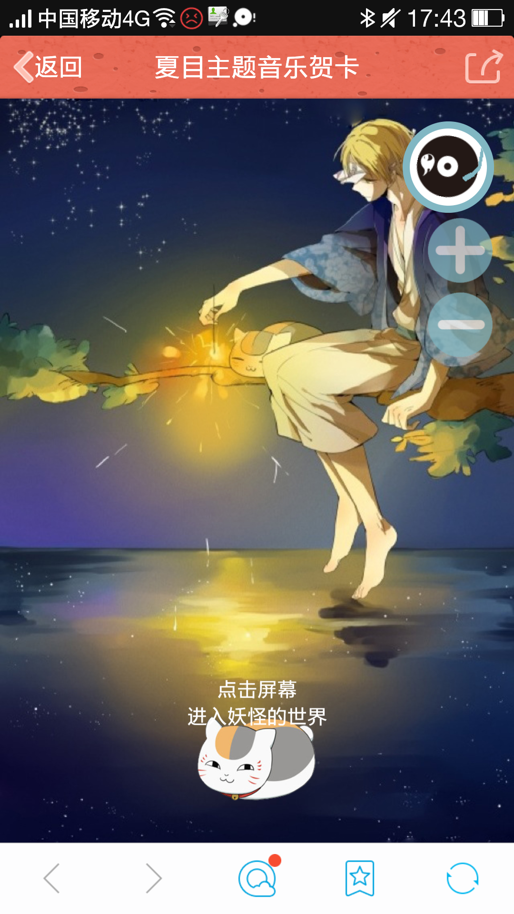
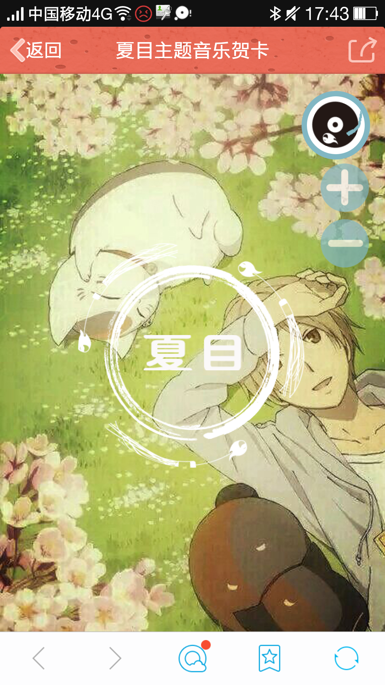
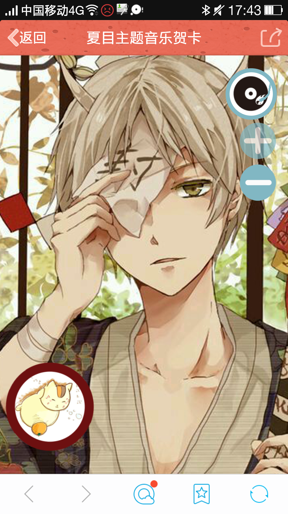

# The-GreetCard-to-Natsume-s-Book-of-Friends
a greeting card which describes of the Natsume's Book of Friends，and it can play music or adjust the volume

（以夏目友人帐为主题做了一个音乐电子贺卡，主要是运行在手机端或chrome手机模式，在右上角的组件中，点击“+”“-”号可以调节音乐音量大小，点击旋转的唱片可以“播放”“暂停”音乐）

The url（直接访问的网址）:https://orangesnow.github.io/The-GreetCard-to-Natsume-s-Book-of-Friends/GreetCard%20of%20Natsume/index.html

## 在手机端运行截图

